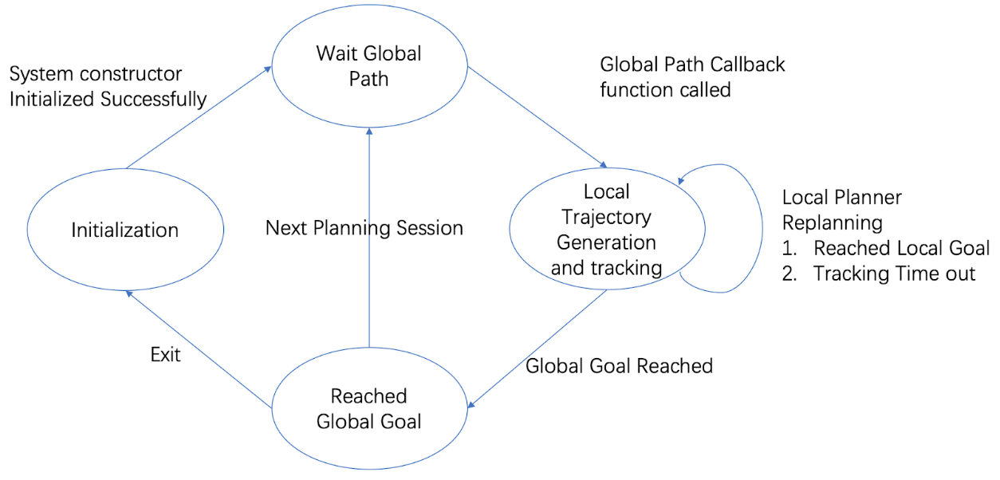
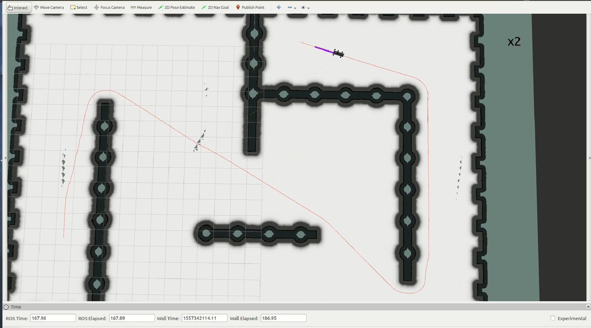
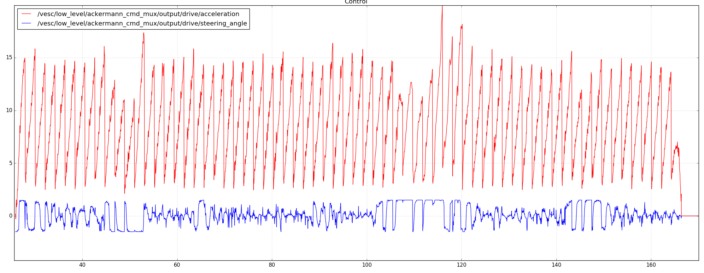
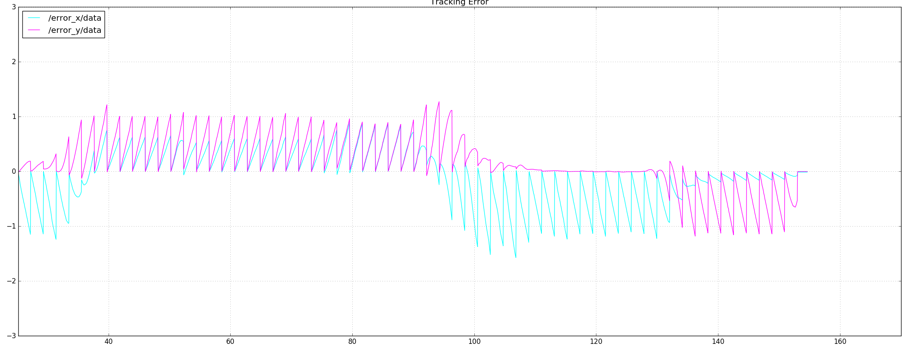
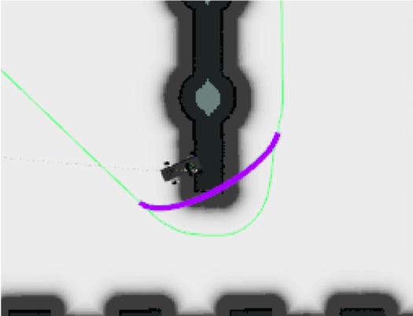
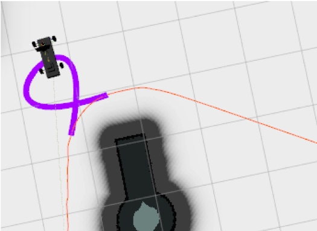

# Race Car Trajectory Generation and Tracking with feedback linearization 
> This is the course project for Non-linear Control and Planning for Robotics Course in JHU

## Introduction
Local trajectory generation and tracking is one of the fundamental problems in robot navigation. A typical navigation task with given map can be divided to global planning, local planning and control. First, using given map with obstacles, global planner can generate a global path with obstacle avoidance, then local planner will generate local smooth trajectories along the global path and control robot to track smooth trajectories.

In this project, we focus on designing local planner for race car robot that dynamically generate local smooth trajectories along the global path with replanning functionality, and use feedback linearization method to control robot tracking the dynamically generated trajectory. We implemented our local planner in C++ and tested in Gazebo simulation environment. 
## Theory
### Dynamic model of the robot car

where the controls are acceleration and steering angle.
### Differential flatness
Consider the problem of generating a trajectory between two given states

The boundary conditions of a differentially flat systems are expressed as

## Control law
The feedback linearization method is applied to design a control law for
generated trajectory $(x(t), y(t))$ let us set the states to be the
form below:

Tracking with feedback is much more desirable in order to have
robustness.Assume that we can measure the position (x1, x2) and we would
like to track it. We specify that by the output

We differentiate the output $y$ till obtain the controls

## System design
Our project used a finite-state machine(FSM) to control the local
planner in navigation. The local planner FSM has 4 states: Initializing,
Waiting for Global Path, Running and Reached Global Goal. States
transition in FSM is shown in Fig [FSM].

​1. Initializing: Local planner initialization, connect all ROS
subscribers and publishers, initialize variables. Once initialization
finished, switch state to Waiting for Global Path state.

​2. Wait for Global Path: Local Planner initialized, waiting for global
path message, once the global path topic callback function is called and
received valid global path, switch to Running state.

​3. Running: For the received global path, dynamically look ahead and
generate trajectory while tracking the trajectory using feedback
linearization in the same time. Once Reached Global in given threshold,
switch to Reached state.

​4. Reached: Reached global goal, either exit and switch initialization
state, or start a new navigation session and switch to Wait for Global
Path state.

## Global Planner
The global planner is based on the ROS built in planner which by default
is Dijkstra algorithm Sec [dji], which uses breadth first search by
given a start and goal in occupancy grid map. The global planner will
publish global path topic with generated waypints. The reason that we
choose Dijkstra algorithm is because for resolution grid search problem,
discrete planner is resolution complete, which in our case will
guarantee a global path if there exists, also the generated path
comparing sampling based method is relatively smooth,which also will
benefit our local planner.

## Local Planner
### Trajectory generation

Local trajectory generation is based on differential flatness of race
car robot model. Traditional trajectory generation method is based on
statically generated trajectory for the whole global path, and control
robot to track series of pre-computed trajectories. In that case,
robot’s tracking error in previous trajectory will significantly
influence tracking performance for next pre-computed trajectory.

In this project, we handle this problem by dynamically generating local
trajectories along the global path with replanning.

### Dynamic Trajectory Generation Strategy in Local Planner

Dynamically generating local trajectory from current robot state can
have better tracking performance and can avoid accumulating tracking
error because previous tracking error won’t affect next replaned
trajectory tracking. In this project, we employ two different strategies
in local planner for dynamic trajectory generation.

**Dynamic Replanning from current pose**

​1. Time out case: If the robot cannot track the trajectory to goal
point with in the time specified in that trajectory and keep tracking
pre-computed next trajectory starting from current unreached goal will
bring current tracking error to next trajectory tracking which greatly
undermine tracking performance. In our project, we handle this problem
by dynamically replanning from nearest waypoint in global path every
time the tracking time out, in that way, previous tracking error won’t
affect following trajectory tracking.

​2. Reached Local case - tracking well:\
If the robot reached local goal in some threshold, we use local goal as
next local trajectory’s start pose.

**Dynamically Lookahead**

Everytime we dynamically choose a new start pose to do replanning, we
lookahead from the new start pose to choose local goal pose. Also, we
parameterized this lookahead value, user can adjust this parameter for
their own global path in different resolution.

**Start and goal velocity Selection**

we also need flat output velocity at local trajectory’s start and goal
pose for local trajectory generation. In this project we set the
velocity magnitude to a fixed reference velocity value, and set the
velocity direction to be the the direction from previous pose to next
pose.

### Trajectory Tracking

In simulation, we have a ros subscriber to update the current odometry
that published from gazebo, then we use current robot state to track
local trajectory using feedback linearization. The output from tracking
process is acceleration and steering angle. In gazebo simulation, we
convert our control input to ackermann message and send to gazebo
simulation to control robot.

### Replanning switch problem
In every iteration, when replanning required, we have to compute next
local trajectory and switch to that trajectory, if we do all this things
in one single thread, the tracking module will have to wait for new
trajectory generated and no control will be sent in the process of
generating trajectory. TO handle this problem, we have dynamic
trajectory generation and tracking running in separate threads and share
the trajectory data between them.

### Experiments Results and Analysis
The process procedures are relatively straightforward: the first step is
to find a collision free path based on the occupancy grid map gazebo
environment, we use Dijkstra to find relative smooth path points, Then
the generated wayponits are published to local planner, the robot based
on its current pose according to the gazebo will start trajectory
generation until the goal is reached. Fig [final] is the screen shot
close to goal reached. The orange line is the global generated path, the
purple line is local generated trajectory.

*final result*

The control plot is shown in Fig [control], the red line is the
acceleration, and the blue line is steering angle, though the controls
looks nosy, this is because we are test in gazebo which accounts noises
and other external forces such as friction, which we didn’t take these
factors into account for our dynamics. For the acceleration in the
graph, every certain time step we could tell that there is a sharp drop,
which corresponds to the actual replanning process, also we set up the
velocity constraints such as $1m/s$ , so after the velocity reaches the
desired value which will stay unchanged even if the acceleration is
still increasing. For the steering angle, even thought the race car has
its own physical property to restrict the steering angle, we also add
our constraints to limit the angle within $[-1, 1]$ in radius.

Below Fig [cte] , shows the final results of the overall process,
tracking error after replanning will drop significantly and previous
trajectory’s tracking error won’t affect dynamically regenerated
trajectory afterward, and thus lead to a more stabilized tracking
performance.

Some Failure case are also shown as below. As shown in Fig [fail1]. the
first case is due the long look head points, so when the robots is in
the Conner situation the the generated trajectory may collide with the
obstacle avoidance, and this problem could be solved in the future
extension with add obstacle avoidance layer or other control law to
steer away. The second failure case is shown in Fig [fail2], which is
very common problem in differential flatness for trajectory generation,
the total time is too long for two close waypoints, so the generating
trajectory will have unusual behaviors to achieve in desired points in
longer time, instead small total time would results in better poly fit.

Conclusions and Future Extension
================================

In summary, we have successfully designed a local planner frame work for
the navigation stack, our trajectory generation template is based on any
system with differential flatness property, which makes the tracking
model can be easily switched between feedback linearization and
backstepping, more importantly the replanning functionality in our local
planner will make the performance robust when there is a time out
failure during tracking, what’s more we have developed a good switch
trajectory strategy can be extended to any tracking planner with
replanning purpose. In the future we could add more stack in the the
framework, such as global planner with cost map,which will need us
implement any motion planning algorithm on occupancy grid map and
costmap to make enough clearance for local planner. Also for our local
planner, we could any dynamic obstacle avoidance functionality, For
better performance, the trajectory generation can adopt better strategy
with time optimization constains. Overall this whole process would be
“small” move base stack in ROS navigation stack.
